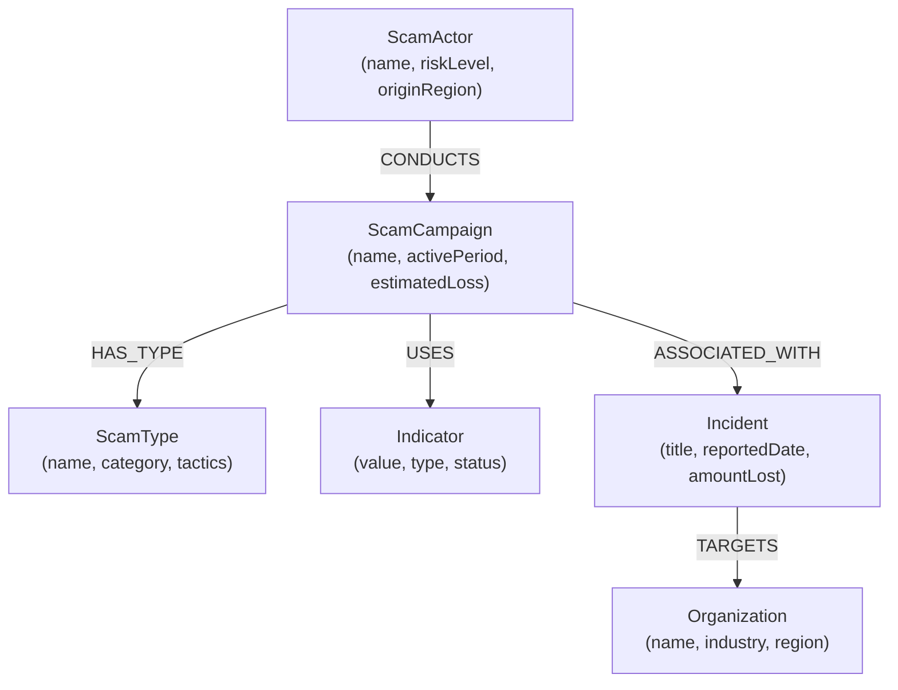

# ScamGraph — Cyber Scam Intelligence Explorer

ScamGraph is an interactive Cyber Scam Intelligence (CSI) visualization and exploration platform powered by **CognoDB**. It empowers fraud analysts, cyber intelligence investigators, and security teams to map, correlate, and analyze complex web-based scam networks, threat syndicates, campaigns, shared infrastructure indicators, and impacted organizations.

---

## Project Overview

Modern cyber fraud operates through complex, decentralized networks. Threat syndicates launch multiple distinct campaigns sharing backend infrastructure—such as mule payment handles, VoIP phone numbers, and phishing domains—to evade traditional detection systems. 

ScamGraph models Cyber Threat Intelligence (CTI) as a connected property graph in **CognoDB**, enabling rapid multi-hop path traversal, discovery of hidden infrastructure overlaps, and visual investigation of scam campaigns.

---

## Problem Statement

Financial fraud and cyber scam operations generate fragmented data scattered across victim crime reports, domain registries, phone number registries, and payment service records.

Traditional tabular analytics fail to reveal critical connections:
- **Siloed Intelligence**: Incident reports record isolated losses without correlating shared payment handles or contact channels used across separate campaigns.
- **Relational Query Bottlenecks**: Discovering if two separate threat actors share infrastructure in a relational database (SQL) requires complex multi-table `JOIN` queries that scale poorly as connection depth increases.
- **Cognitive Overhead**: Tabular data makes it difficult for security analysts to quickly grasp multi-hop relationships between actors, tactics, indicators, and target entities.

---

## Use Case

ScamGraph targets **Cyber Fraud & Threat Intelligence Analysis**:
1. **Indicator Pivot & Correlation**: An analyst investigating a newly reported mule payment ID can immediately visualize all connected scam campaigns and threat actors using that handle.
2. **Infrastructure Overlap Discovery**: Uncovering hidden structural ties between seemingly unrelated scam campaigns by detecting shared indicators (e.g., identical phone numbers or payment handles).
3. **Target Impact Analysis**: Tracking how specific industry sectors or organizations are targeted across different campaign vectors and scam categories.

---

## How ScamGraph Works

1. **Graph Ingestion**: Threat intelligence entities (actors, campaigns, scam types, indicators, incidents, and targeted organizations) and their relationships are stored natively in **CognoDB**.
2. **Parameterized Cypher Execution**: User search queries and graph inspection requests trigger optimized Cypher queries via standard Bolt protocol (`neo4j-driver`).
3. **Interactive Visual Canvas**: Query results are returned to an interactive 2D graph visualizer (`react-force-graph-2d`) allowing analysts to drag, zoom, inspect node metadata, and expand multi-hop connections.
4. **Shared Indicator Overlap Detection**: Automated graph query logic pinpoints overlapping infrastructure items shared across campaigns to expose underlying threat syndicates.

---

## Why a Graph Database?

Graph databases treat **relationships as first-class entities**. For cyber threat intelligence, connections between data points carry equal or greater analytical value than the properties of individual nodes.

### CognoDB Graph vs. Relational (SQL) Database

| Capability | Relational Database (SQL) | Graph Database (CognoDB) |
| :--- | :--- | :--- |
| **Model Fit** | Fixed, tabular schemas requiring foreign key mapping tables. | Native nodes and edges representing real-world threat networks. |
| **Multi-Hop Traversal** | Requires expensive `JOIN` operations across 5+ tables that slow down exponentially with depth. | Index-free adjacency allows constant-time traversal regardless of graph size. |
| **Shared Indicator Discovery** | Requires multiple self-joins (`JOIN` on `USES`, `JOIN` on `CONDUCTS`, etc.). | Concise Cypher pattern match: `(c1)-[:USES]->(i)<-[:USES]-(c2)`. |
| **Schema Flexibility** | Schema migrations required when adding new indicator types or relationship types. | Dynamic node labels and edge properties without schema lock-in. |

---

## Key Features

- **Universal Threat Entity Search**: Instant search across threat actors, campaign names, aliases, and indicator values.
- **Multi-Hop Graph Visualization**: Dynamic, color-coded node-link graph renderer with force-directed layout and interactive node selection.
- **Shared Infrastructure Overlap Matrix**: Dedicated correlation panel listing shared indicators between distinct campaigns and their associated threat syndicates.
- **Detailed Node Property Inspector**: Side-panel display of risk levels, active periods, estimated financial losses, tactics, and origin regions.
- **Health & Connection Diagnostics**: Live backend database connection status verification.

---

## Graph Data Model

ScamGraph models the cyber fraud ecosystem using **6 distinct Node Types** and **5 Relationship Types**.

### Node Types

1. **ScamActor**: The threat actor or criminal syndicate (e.g., `Syndicate Alpha`, `PhishCraft Network`).
2. **ScamCampaign**: A specific scam operation (e.g., `Fake Electricity Bill Scam Wave`, `Bank KYC Renewal Fraud`).
3. **ScamType**: The taxonomy category and tactics (e.g., `Utility Bill Fraud`, `Banking Phishing`).
4. **Indicator**: Technical indicator of compromise / infrastructure item (e.g., payment handle, phone number, phishing domain).
5. **Incident**: Specific victim report or reported fraud event.
6. **Organization**: Targeted institution or industry entity (e.g., `State Electricity Board`, `Metro Commercial Bank`).

### Relationship Types

- `(:ScamActor)-[:CONDUCTS]->(:ScamCampaign)`
- `(:ScamCampaign)-[:HAS_TYPE]->(:ScamType)`
- `(:ScamCampaign)-[:USES]->(:Indicator)`
- `(:ScamCampaign)-[:ASSOCIATED_WITH]->(:Incident)`
- `(:Incident)-[:TARGETS]->(:Organization)`

### Data Model Diagram



---

## Investigation Workflow

1. **Search & Select**: The analyst enters a query in the search bar (e.g., `Syndicate Alpha` or `fastpay-mule@example.test`).
2. **Graph Traversal**: ScamGraph executes a multi-hop Cypher traversal query starting from the selected seed entity up to 3 hops outward.
3. **Visual Correlation**: The application renders the entity graph. Nodes are color-coded by type, and edges display relationship semantics.
4. **Inspect Node Properties**: Selecting a node updates the detail panel with rich metadata (e.g., estimated financial impact, status, aliases).
5. **Overlap Analysis**: The overlap detection engine queries the graph for shared indicators, revealing if the target entity shares payment handles or phone numbers with other active campaigns.

---

## Example Graph Investigation

### Scenario: Investigating `Syndicate Alpha`

- **Seed Entity**: Threat Actor `Syndicate Alpha` (`sa-1`).
- **Hop 1 (`CONDUCTS`)**: Reveals two campaigns: `Fake Electricity Bill Scam Wave` (`sc-1`) and `Loan Approval Fee Fraud` (`sc-4`).
- **Hop 2 (`USES`)**: 
  - Campaign `sc-1` uses indicator `fastpay-mule@example.test` (`ind-1`) and phone number `+91-90000-00001` (`ind-2`).
  - Campaign `sc-4` also uses phone number `+91-90000-00001` (`ind-2`).
- **Hop 3 (`Shared Infrastructure Overlap`)**:
  - Indicator `fastpay-mule@example.test` (`ind-1`) is also used by `Bank KYC Renewal Fraud` (`sc-2`), operated by a second syndicate `PhishCraft Network` (`sa-2`).
- **Insight**: The investigation proves that `Syndicate Alpha` and `PhishCraft Network` share payment infrastructure (`fastpay-mule@example.test`), establishing operational collusion or shared infrastructure provider usage between the two syndicates.

---

## Cypher Queries

All Cypher queries in ScamGraph are strictly parameterized to ensure safety and query plan caching.

### 1. Normal Graph Search Query

Performs case-insensitive pattern matching across actors, campaigns, aliases, and indicator values.

```cypher
MATCH (n)
WHERE (n:ScamActor AND (toLower(n.name) CONTAINS toLower($searchTerm) OR ANY(alias IN n.aliases WHERE toLower(alias) CONTAINS toLower($searchTerm))))
   OR (n:ScamCampaign AND toLower(n.name) CONTAINS toLower($searchTerm))
   OR (n:Indicator AND toLower(n.value) CONTAINS toLower($searchTerm))
RETURN n.id AS id, 
       COALESCE(n.name, n.value) AS name, 
       n.value AS value, 
       labels(n)[0] AS type, 
       n.type AS indicatorType,
       n.originRegion AS originRegion,
       n.riskLevel AS riskLevel,
       n.estimatedLoss AS estimatedLoss
LIMIT 10
```

### 2. Multi-Hop Traversal Query (1 to 3 Hops)

Traverses variable-length paths from a starting entity node across all threat graph relationship types.

```cypher
MATCH path = (start)-[:CONDUCTS|USES|HAS_TYPE|ASSOCIATED_WITH|TARGETS*1..3]-(target)
WHERE start.id = $entityId
RETURN path
```

### 3. Shared Indicator Overlap Query (Awkward in Relational Databases)

Finds infrastructure overlaps where two distinct campaigns share at least one common indicator, linking both campaigns back to their respective threat actors.

```cypher
MATCH (c1:ScamCampaign)-[:USES]->(i:Indicator)<-[:USES]-(c2:ScamCampaign)
WHERE c1 <> c2 AND (c1.id = $entityId OR c2.id = $entityId OR i.id = $entityId)
MATCH (a1:ScamActor)-[:CONDUCTS]->(c1)
MATCH (a2:ScamActor)-[:CONDUCTS]->(c2)
RETURN 
  c1.name AS sourceCampaign, 
  a1.name AS sourceActor,
  i.value AS sharedIndicator, 
  i.type AS indicatorType,
  c2.name AS relatedCampaign, 
  a2.name AS relatedActor
```

*Note: Achieving this in a relational database requires multiple expensive `JOIN` operations across `Campaigns`, `Campaign_Indicators`, `Indicators`, and `Actors` tables.*

---

## Technology Stack

- **Frontend**: React (v19), Vite, Tailwind CSS (v4), Lucide React, `react-force-graph-2d`, Axios
- **Backend**: Node.js, Express (v5), CORS, dotenv, JSONWebToken, bcryptjs
- **Database**: CognoDB (Graph Database Cloud)
- **Database Driver**: `neo4j-driver` (v5.28.1 - Bolt protocol client)
- **Query Language**: Cypher
- **Build / Development**: Vite, Nodemon, ESLint, PostCSS, npm

---

## Project Structure

```
threat-graph/
├── client/
│   ├── public/
│   ├── src/
│   │   ├── components/
│   │   │   ├── AuthModal.jsx
│   │   │   ├── GraphCanvas.jsx
│   │   │   ├── ScamDetails.jsx
│   │   │   ├── SearchBar.jsx
│   │   │   └── StatusStateViews.jsx
│   │   ├── services/
│   │   │   └── api.js
│   │   ├── App.css
│   │   ├── App.jsx
│   │   ├── index.css
│   │   └── main.jsx
│   ├── package.json
│   ├── tailwind.config.js
│   └── vite.config.js
└── server/
    ├── src/
    │   ├── config/
    │   │   └── database.js
    │   ├── controllers/
    │   │   ├── authController.js
    │   │   └── scamController.js
    │   ├── middleware/
    │   │   └── authMiddleware.js
    │   ├── queries/
    │   │   └── cypherQueries.js
    │   ├── routes/
    │   │   ├── authRoutes.js
    │   │   └── scamRoutes.js
    │   ├── seed/
    │   │   └── seedData.js
    │   └── services/
    │       └── scamService.js
    ├── .env.example
    ├── index.js
    └── package.json
```

---

## Prerequisites

- **Node.js**: v18.x or higher
- **npm**: v9.x or higher
- **CognoDB Cloud Instance**: Active instance credentials (URI, Username, Password) supporting the Bolt protocol.

---

## Local Setup

### 1. Clone Repository

```bash
git clone https://github.com/Lasya1905/ScamGraph.git
cd threat-graph
```

### 2. Configure Server Environment

Navigate to the `server` directory and set up environment variables.

```bash
cd server
npm install
```

Create a `.env` file based on `.env.example`:

```bash
# Example server/.env contents
COGNO_DB_URI=bolt+s://<your-cognodb-instance-id>.databases.cognodb.com
COGNO_DB_USER=cognodb
COGNO_DB_PASSWORD=<your-cognodb-password>
PORT=5000
JWT_SECRET=<your-secret-jwt-key>
```

### 3. Seed CognoDB Graph Database

Populate your CognoDB instance with synthetic Cyber Scam Intelligence data:

```bash
npm run seed
```

### 4. Configure & Install Client Dependencies

Navigate to the `client` directory and install dependencies:

```bash
cd ../client
npm install
```

---

## Environment Variables

| Variable Name | Description | Scope |
| :--- | :--- | :--- |
| `COGNO_DB_URI` | CognoDB connection URI (`bolt+s://...`) | Backend (`server/.env`) |
| `COGNO_DB_USER` | CognoDB database user account | Backend (`server/.env`) |
| `COGNO_DB_PASSWORD` | CognoDB user password | Backend (`server/.env`) |
| `PORT` | API server port (default: `5000`) | Backend (`server/.env`) |
| `JWT_SECRET` | Secret key for signing JWT tokens | Backend (`server/.env`) |
| `VITE_API_BASE_URL` | Base URL for Express backend API | Frontend (`client/.env`) |

---

## Running the Application

### Start Backend API Server

From the `server/` folder:

```bash
npm run dev
```

The Express API server starts at `http://localhost:5000`.

### Start Frontend Client

From the `client/` folder:

```bash
npm run dev
```

The React Vite application opens at `http://localhost:5173`.

---

## API Endpoints

| Method | Endpoint | Description | Auth Required |
| :--- | :--- | :--- | :--- |
| `GET` | `/api/health` | Verifies server and CognoDB connection status | No |
| `POST` | `/api/auth/signup` | Registers a new analyst user account | No |
| `POST` | `/api/auth/login` | Authenticates analyst credentials and returns JWT | No |
| `GET` | `/api/auth/me` | Returns current user profile | Yes (Bearer Token) |
| `GET` | `/api/scam-entities/search?q=<query>` | Searches entities across name, alias, and indicator value | No |
| `GET` | `/api/scam-entities/:id` | Returns properties and details for a specific entity | No |
| `GET` | `/api/scam-entities/:id/graph` | Traverses 1 to 3 hops out and returns nodes/links payload | No |
| `GET` | `/api/scam-entities/:id/overlaps` | Returns shared indicator overlaps connected to the entity | No |

---

## Error Handling & Application States

- **Loading State**: Displays clean spinner animations while graph traversals and search queries execute.
- **Empty State**: Friendly notices when entity searches return zero results or no shared indicators are detected.
- **Database Connection Error**: The `/api/health` endpoint and UI status banner alert analysts if CognoDB is unreachable.
- **Server Error Middleware**: Express handles 404 unknown routes and formats internal exceptions into clean JSON error responses.

---

## Security & Configuration

- Database credentials (`COGNO_DB_PASSWORD`, `COGNO_DB_URI`) are strictly loaded via server environment variables.
- Sensitive config files (`.env`) are explicitly ignored in `.gitignore` to prevent credential leaks.
- User inputs passed to Cypher queries are fully parameterized, neutralizing Cypher injection risks.

---

## Screenshots / Demo

*Placeholder section for visual application demonstration.*

- **Main Application Interface**: ``
- **Graph Investigation Visualizer**: ``
- **Shared Indicator Discovery View**: ``

---

## Hosted Demo

- **Deployed Application URL**: `[Deployment Link Placeholder - To Be Added]`

---

## Screen Recording

- **Video Walkthrough**: `[Demo Video Recording Link Placeholder - To Be Added]`

---

## Future Improvements

- **Real-Time Data Ingestion**: Webhook integration for live submission of community fraud reports.
- **Centrality & PageRank Scoring**: Graph algorithms to score high-impact mule payment handles automatically.
- **Timeline Filtering**: Filtering graph visualizer views by campaign active date ranges.

---

## Author

- **Lasya** ([github.com/Lasya2219](https://github.com/Lasya2219))
